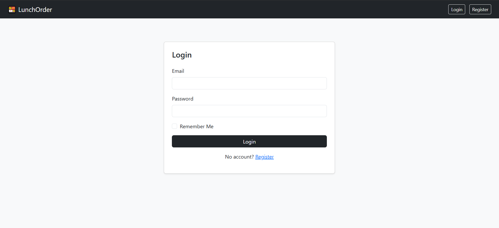
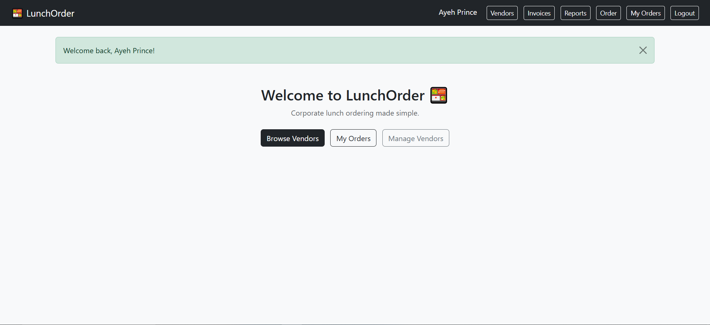
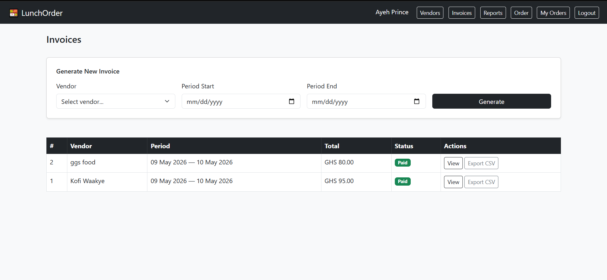
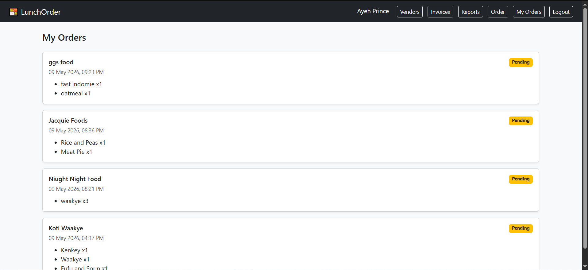
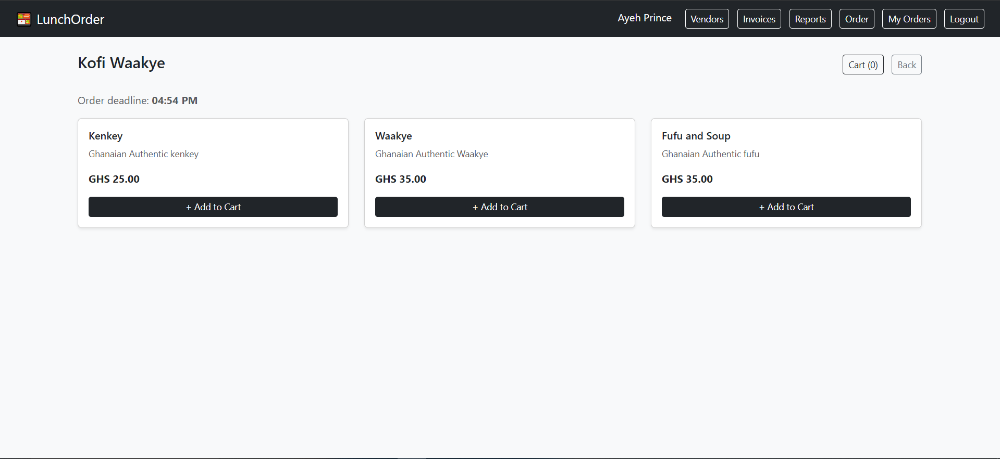
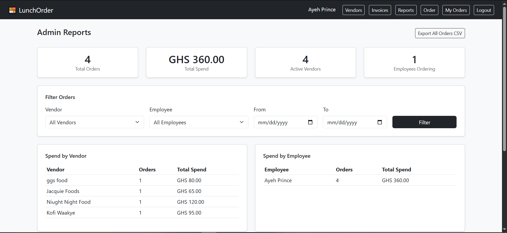
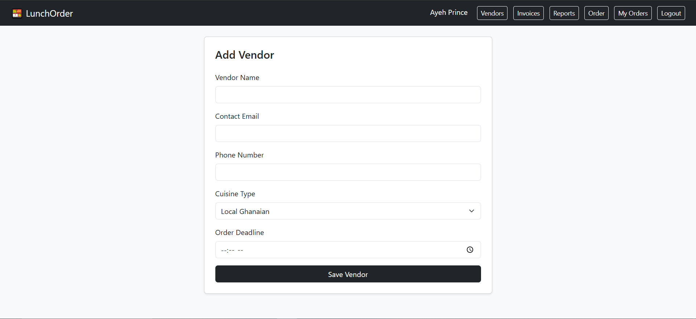
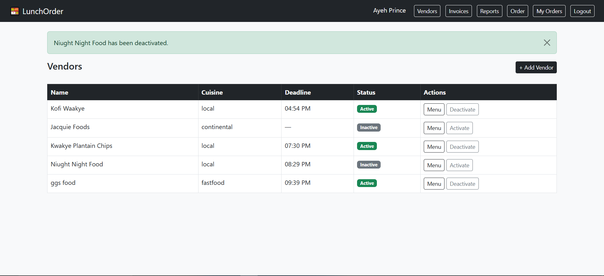
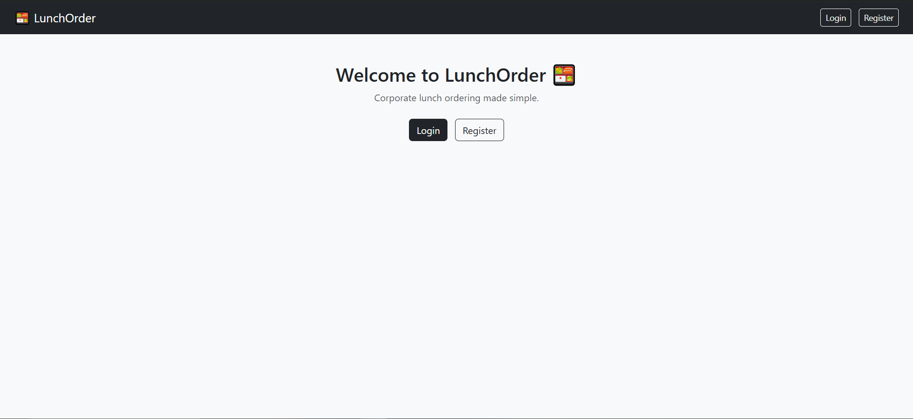

# LOS First

A lunch ordering system designed to streamline meal requests within a company environment.

## Features

- Employee lunch ordering
- Order tracking
- Database integration
- Simple user interface
- Admin management functionality

## Technologies Used

- Python
- HTML/CSS
- Flask

## Installation

1. Clone the repository

```bash
git clone https://github.com/AyehPrince/LOS-first.git
```

2. Open the project in Visual Studio Code or Visual Studio

3. Configure database settings

4. Run the application

## Screenshots




















## Future Improvements

- Authentication system
- Mobile support
- Notification system
- Analytics dashboard

## Author

Prince Ayeh